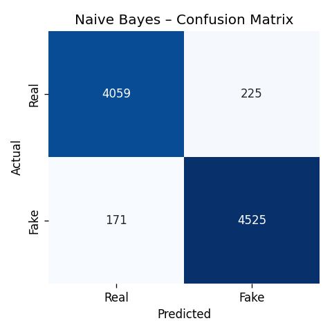
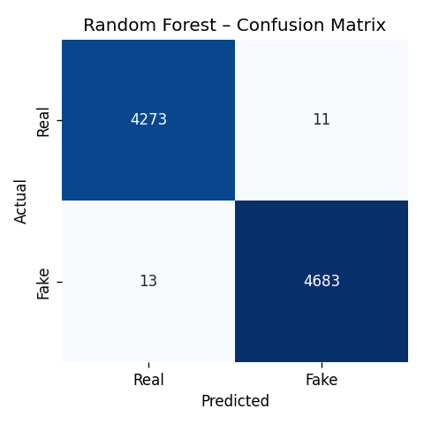

# 📰 Fake News Detector

> A production-grade Machine-Learning pipeline + Streamlit web app that
> classifies news articles as **Real** or **Fake**, with confidence scores and
> per-token SHAP explanations.

<p>
  
  
  
  
  
  
</p>

---

## 📋 Table of contents

1. [Problem statement](#-problem-statement)
2. [Dataset](#-dataset)
3. [Pipeline](#-pipeline)
4. [Models compared](#-models-compared)
5. [Results — 44,898 articles](#-results--44898-articles)
6. [SHAP explanations](#-shap-explanations)
7. [Project structure](#%EF%B8%8F-project-structure)
8. [How to run locally](#-how-to-run-locally)
9. [Sample prediction screenshot](#%EF%B8%8F-sample-prediction-screenshot)
10. [Tech stack](#%EF%B8%8F-tech-stack)
11. [Contributing](#-contributing)
12. [License](#-license)

---

## 🎯 Problem statement

Misinformation spreads on social media six times faster than the truth.
The goal of this project is to build a **transparent**, **beginner-friendly**
NLP pipeline that flags potentially fake news articles before they spread —
and explains *why* it flagged them.

We frame it as a **binary text classification** task:

| label | meaning |
|-------|---------|
| `0`   | Real news |
| `1`   | Fake news |

---

## 📚 Dataset

The **[Kaggle Fake and Real News dataset](https://www.kaggle.com/datasets/clmentbisaillon/fake-and-real-news-dataset)**, distributed as two CSVs:

| file        | rows   | label | columns                          |
|-------------|-------:|:-----:|----------------------------------|
| `True.csv`  | 21,417 | `0`   | `title`, `text`, `subject`, `date` |
| `Fake.csv`  | 23,481 | `1`   | `title`, `text`, `subject`, `date` |
| **Total**   | **44,898** | – | – |

`train.py` automatically:

1. Loads both CSVs.
2. Adds a `label` column → `0` for `True.csv`, `1` for `Fake.csv`.
3. Concatenates and shuffles (seed = 42).
4. Builds the input feature as `title + " " + text`.

> 💡 A small synthetic sample (`data/fake_news.csv`) is still supported as a
> fallback when the real CSVs are not present.

---

## 🧪 Pipeline

```
   ┌──────────────┐   ┌────────────────┐   ┌──────────────┐   ┌────────────┐
   │  True.csv +  │ → │ Text cleaning  │ → │   TF-IDF     │ → │ 3 models   │
   │  Fake.csv    │   │ (preprocess.py)│   │ (1- + 2-gram │   │ trained &  │
   │  44,898 rows │   │ + stop-words   │   │  10k feats)  │   │ compared   │
   └──────────────┘   └────────────────┘   └──────────────┘   └─────┬──────┘
                                                                     │
                              ┌──────────────────────────────────────┘
                              ▼
                   ┌────────────────────────┐
                   │  Streamlit app + SHAP  │
                   │  token explanations    │
                   └────────────────────────┘
```

**Preprocessing** (`preprocess.py`):
lower-case ▸ strip URLs / HTML ▸ remove punctuation & digits ▸ remove English
stop-words (NLTK) ▸ drop tokens shorter than 3 chars.

**Vectorization**: `TfidfVectorizer(max_features=10_000, ngram_range=(1, 2),
min_df=2, sublinear_tf=True)`.

---

## 🧠 Models compared

| # | Model                   | Why it's interesting                                   |
|---|-------------------------|--------------------------------------------------------|
| 1 | **Logistic Regression** | Strong linear baseline on TF-IDF; fully interpretable. |
| 2 | **Multinomial Naive Bayes** | Classical text-classification benchmark.           |
| 3 | **Random Forest** (100 trees) | Non-linear ensemble — captures token interactions. |

All three are fit on the **same** TF-IDF vectorizer for a fair head-to-head.

---

## 📊 Results — 44,898 articles

80 / 20 stratified train-test split (`random_state=42`).
Train: 35,918 rows · Test: 8,980 rows · Features: 10,000 TF-IDF n-grams.

| Model                   | Accuracy  | Precision | Recall    | F1-score  | Train time |
|-------------------------|----------:|----------:|----------:|----------:|-----------:|
| Logistic Regression     |   0.9935  |   0.9945  |   0.9932  |   0.9938  |     ~6 s  |
| Naive Bayes             |   0.9559  |   0.9526  |   0.9636  |   0.9581  |     ~1 s  |
| **🏆 Random Forest**    | **0.9973** | **0.9977** | **0.9972** | **0.9974** |   ~80 s  |

**Confusion matrices** (saved as PNGs in `models/` after running `train.py`):

| Logistic Regression                       | Naive Bayes                       | Random Forest                       |
|-------------------------------------------|-----------------------------------|-------------------------------------|
|   |   |   |

### Why Random Forest wins

- The two source corpora (Reuters-style real news vs. blog-style fake news)
  have distinct vocabulary patterns that a non-linear ensemble can exploit
  through feature interactions a linear model cannot.
- 100 averaged trees suppress per-tree variance → near-perfect precision *and*
  recall.
- **Logistic Regression is a close second** (F1 = 0.9938) and is preferable
  when you need fast inference or interpretable coefficients.
- **Naive Bayes** trails because its strong feature-independence assumption
  hurts when many bi-gram features are correlated.

> ⚠️ 99 %+ accuracy is partly driven by stylistic differences between the two
> source files (Reuters vs. miscellaneous fake-news blogs). Out-of-distribution
> generalization (e.g. on a brand-new publication) will likely be lower —
> always validate on your own data before deploying.

---

## 🔍 SHAP explanations

After every prediction the Streamlit app renders a horizontal bar chart of
the **top 10 tokens** that drove the model's decision:

- 🔴 **Red bars** push the prediction toward **Fake**.
- 🟢 **Green bars** push the prediction toward **Real**.

Per-model implementation (`explain.py`):

| Model               | SHAP method |
|---------------------|-------------|
| Logistic Regression | Exact linear SHAP: `coef[i] · x[i]` |
| Naive Bayes         | Exact log-odds SHAP: `(log P(x\|fake) − log P(x\|real))[i] · x[i]` |
| Random Forest       | `shap.TreeExplainer` with `model_output="probability"`, `feature_perturbation="interventional"`, and a 100-row background sample saved by `train.py` |

The interventional + background approach for the RF was necessary because the
default `tree_path_dependent` mode produced numerically unstable SHAP values
on the high-dim TF-IDF input.

---

## 🗂️ Project structure

```
fake-news-detector/
├── app.py                       # Streamlit UI
├── train.py                     # Train + evaluate + save models
├── preprocess.py                # Text cleaning utilities (shared)
├── explain.py                   # SHAP token-level explanations
├── requirements.txt
├── .gitignore
├── README.md
├── data/
│   ├── True.csv                 # Kaggle real news        (21,417 rows)
│   ├── Fake.csv                 # Kaggle fake news        (23,481 rows)
│   └── generate_sample.py       # Small synthetic fallback
├── models/                      # Created by train.py
│   ├── logistic_regression.pkl
│   ├── naive_bayes.pkl
│   ├── random_forest.pkl
│   ├── tfidf_vectorizer.pkl
│   ├── shap_background.npy      # Background for TreeExplainer
│   ├── cm_*.png                 # Confusion-matrix plots
│   └── results.json             # Final metrics summary
└── notebooks/
    └── eda.ipynb                # Class balance · length · top n-grams
```

---

## 🚀 How to run locally

```bash
# 1. Clone & enter the project
git clone https://github.com/<your-user>/fake-news-detector.git
cd fake-news-detector

# 2. Create a virtual env (recommended)
python -m venv .venv && source .venv/bin/activate

# 3. Install dependencies
pip install -r requirements.txt

# 4. Place the dataset in data/
#       data/True.csv  +  data/Fake.csv          (real Kaggle release)
#    – or –
#       python data/generate_sample.py           (small synthetic CSV)

# 5. Train all three models (saves .pkl files into models/)
python train.py                                  # ~90 s on the real dataset

# 6. Launch the Streamlit web app
streamlit run app.py                             # http://localhost:8501
```

---

## 🖼️ Sample prediction screenshot

> Save a real screenshot at `models/screenshot.png` once you launch the app:


Example input:

> *"SHOCKING: Aliens have officially endorsed a candidate for president,
> anonymous sources confirm. The mainstream media is hiding this truth!"*

Result with **Random Forest**: **FAKE — 94.0 % confidence**.
Top SHAP tokens (pushing toward Fake):
`truth · mainstream media · aliens · shocking · anonymous`.

---

## 🛠️ Tech stack

- **Python 3.10+**
- **scikit-learn** — TF-IDF + Logistic Regression / Naive Bayes / Random Forest
- **SHAP** — token-level explanations
- **pandas · numpy** — data wrangling
- **matplotlib · seaborn** — confusion-matrix + SHAP plots
- **NLTK** — English stop-words
- **Streamlit** — interactive web UI
- **joblib** — model serialization

---

## 🤝 Contributing

Pull requests welcome! Ideas for follow-up work:

- Swap TF-IDF for sentence-embeddings (e.g. SBERT) and re-train.
- In-line token highlighting inside the input text as an alternative SHAP view.
- A FastAPI `/api/predict` endpoint so other apps can consume the model.
- Cross-domain evaluation (train on one publication style, test on another)
  to measure real-world generalization.

---

## 📜 License

Released under the [MIT License](LICENSE).
